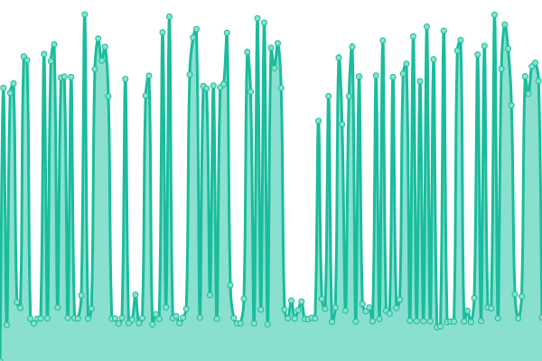
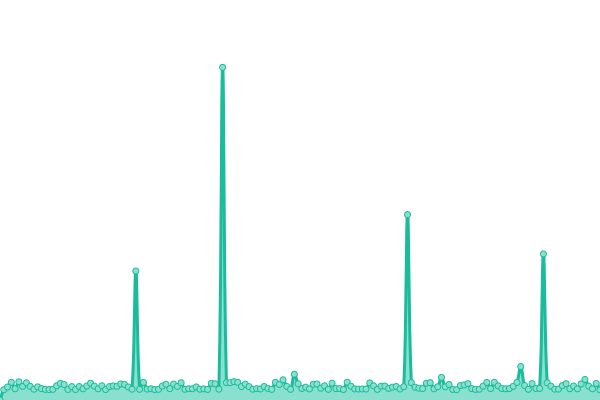

# [📈 Live Status](https://pionyr.github.io/status): <!--live status--> **🟧 Partial outage**

This repository contains the open-source uptime monitor and status page for [Pionýr](https://pionyr.cz), powered by [Upptime](https://github.com/upptime/upptime).

With [Upptime](https://upptime.js.org), you can get your own unlimited and free uptime monitor and status page, powered entirely by a GitHub repository. We use [Issues](https://github.com/pionyr/status/issues) as incident reports, [Actions](https://github.com/pionyr/status/actions) as uptime monitors, and [Pages](https://pionyr.github.io/status) for the status page.

<!--start: status pages-->
<!-- This summary is generated by Upptime (https://github.com/upptime/upptime) -->
<!-- Do not edit this manually, your changes will be overwritten -->
<!-- prettier-ignore -->
| URL | Status | History | Response Time | Uptime |
| --- | ------ | ------- | ------------- | ------ |
|  [Pionyr.cz](https://pionyr.cz/) | 🟥 Down | [pionyr-cz.yml](https://github.com/pionyr/status/commits/HEAD/history/pionyr-cz.yml) | 

 2980ms
     
 | 

<a href="https://pionyr.github.io/status/history/pionyr-cz">99.97%</a>
    

|  [RISP](https://risp.pionyr.cz/RISP/MainForm.wgx) | 🟩 Up | [risp.yml](https://github.com/pionyr/status/commits/HEAD/history/risp.yml) | 

 2327ms
     
 | 

<a href="https://pionyr.github.io/status/history/risp">100.00%</a>
    

|  [Mozaika](https://mozaika.pionyr.cz/) | 🟥 Down | [mozaika.yml](https://github.com/pionyr/status/commits/HEAD/history/mozaika.yml) | 

 3466ms
     
 | 

<a href="https://pionyr.github.io/status/history/mozaika">99.79%</a>
    

|  [Praha.pionyr.cz](https://praha.pionyr.cz/) | 🟥 Down | [praha-pionyr-cz.yml](https://github.com/pionyr/status/commits/HEAD/history/praha-pionyr-cz.yml) | 

 2301ms
     
 | 

<a href="https://pionyr.github.io/status/history/praha-pionyr-cz">99.97%</a>
    

|  [Praha.pionyr.cz (static status)](https://praha.pionyr.cz/status.html) | 🟩 Up | [praha-pionyr-cz-static-status.yml](https://github.com/pionyr/status/commits/HEAD/history/praha-pionyr-cz-static-status.yml) | 

 120ms
     
 | 

<a href="https://pionyr.github.io/status/history/praha-pionyr-cz-static-status">100.00%</a>
    

|  [Praha.pionyr.cz (dynamic status)](https://praha.pionyr.cz/status.php) | 🟥 Down | [praha-pionyr-cz-dynamic-status.yml](https://github.com/pionyr/status/commits/HEAD/history/praha-pionyr-cz-dynamic-status.yml) | 

 122ms
     
 | 

<a href="https://pionyr.github.io/status/history/praha-pionyr-cz-dynamic-status">99.91%</a>
    

|  [Ledová města](https://ledovamesta.pionyr.cz/) | 🟥 Down | [ledova-mesta.yml](https://github.com/pionyr/status/commits/HEAD/history/ledova-mesta.yml) | 

 3740ms
     
 | 

<a href="https://pionyr.github.io/status/history/ledova-mesta">99.97%</a>
    

|  [Ledová Praha](https://ledovapraha.cz/) | 🟥 Down | [ledova-praha.yml](https://github.com/pionyr/status/commits/HEAD/history/ledova-praha.yml) | 

 3795ms
     
 | 

<a href="https://pionyr.github.io/status/history/ledova-praha">99.97%</a>
    

|  [Děti dětem](https://detidetem.pionyr.cz/) | 🟥 Down | [deti-detem.yml](https://github.com/pionyr/status/commits/HEAD/history/deti-detem.yml) | 

 3344ms
     
 | 

<a href="https://pionyr.github.io/status/history/deti-detem">99.82%</a>
    

|  [Babi dědo](https://babidedo.pionyr.cz/) | 🟥 Down | [babi-dedo.yml](https://github.com/pionyr/status/commits/HEAD/history/babi-dedo.yml) | 

 2267ms
     
 | 

<a href="https://pionyr.github.io/status/history/babi-dedo">99.97%</a>
    

|  [Pionýrské fórum](https://forum.pionyr.cz/) | 🟥 Down | [pionyrske-forum.yml](https://github.com/pionyr/status/commits/HEAD/history/pionyrske-forum.yml) | 

 1964ms
     
 | 

<a href="https://pionyr.github.io/status/history/pionyrske-forum">99.97%</a>
    

|  [Pionýrská kuchařka](https://kucharka.pionyr.cz/) | 🟥 Down | [pionyrska-kucharka.yml](https://github.com/pionyr/status/commits/HEAD/history/pionyrska-kucharka.yml) | 

 3165ms
     
 | 

<a href="https://pionyr.github.io/status/history/pionyrska-kucharka">99.59%</a>
    

|  [Lvicata.cz (not hosted by Pionýr)](https://www.lvicata.cz/) | 🟩 Up | [lvicata-cz-not-hosted-by-pionyr.yml](https://github.com/pionyr/status/commits/HEAD/history/lvicata-cz-not-hosted-by-pionyr.yml) | 

 923ms
     
 | 

<a href="https://pionyr.github.io/status/history/lvicata-cz-not-hosted-by-pionyr">100.00%</a>
    

<!--end: status pages-->

[**Visit our status website →**](https://pionyr.github.io/status)

## 📄 License

- Powered by: [Upptime](https://github.com/upptime/upptime)
- Code: [MIT](./LICENSE) © [Pionýr](https://pionyr.cz)
- Data in the `./history` directory: [Open Database License](https://opendatacommons.org/licenses/odbl/1-0/)
